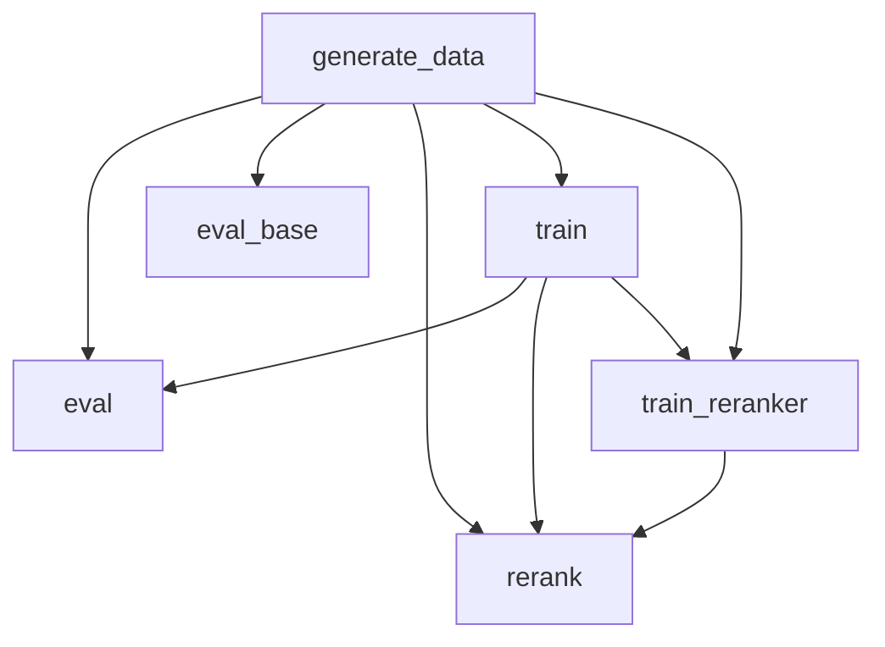

```mermaid
flowchart TD
	node1["eval"]
	node2["eval_base"]
	node3["generate_data"]
	node4["rerank"]
	node5["train"]
	node6["train_reranker"]
	node3-->node1
	node3-->node2
	node3-->node4
	node3-->node5
	node3-->node6
	node5-->node1
	node5-->node4
	node5-->node6
	node6-->node4
```
