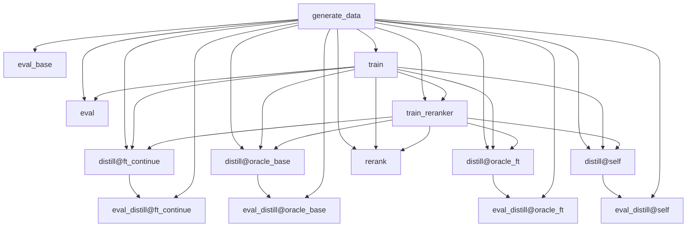

```mermaid
flowchart TD
	node1["distill@ft_continue"]
	node2["distill@oracle_base"]
	node3["distill@oracle_ft"]
	node4["distill@self"]
	node5["eval"]
	node6["eval_base"]
	node7["eval_distill@ft_continue"]
	node8["eval_distill@oracle_base"]
	node9["eval_distill@oracle_ft"]
	node10["eval_distill@self"]
	node11["generate_data"]
	node12["rerank"]
	node13["train"]
	node14["train_reranker"]
	node1-->node7
	node2-->node8
	node3-->node9
	node4-->node10
	node11-->node1
	node11-->node2
	node11-->node3
	node11-->node4
	node11-->node5
	node11-->node6
	node11-->node7
	node11-->node8
	node11-->node9
	node11-->node10
	node11-->node12
	node11-->node13
	node11-->node14
	node13-->node1
	node13-->node2
	node13-->node3
	node13-->node4
	node13-->node5
	node13-->node12
	node13-->node14
	node14-->node1
	node14-->node2
	node14-->node3
	node14-->node4
	node14-->node12
```
