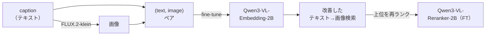

<!-- Language / 言語: **日本語** | [English](README.md) -->

# Qwen3-VL マルチモーダル埋め込み ファインチューニング・デモ

**合成データだけで「画像検索の精度が上がる」体験**を、最小構成で一気通貫に再現するデモです。

1. 🎨 **データ生成** — 画像生成モデル [FLUX.2-klein-4B](https://huggingface.co/black-forest-labs/FLUX.2-klein-4B) で、キャプション付き画像データセットを自動生成（キャプション＝そのまま検索クエリの正解になる）
2. 📐 **ベース評価** — [Qwen3-VL-Embedding-2B](https://huggingface.co/Qwen/Qwen3-VL-Embedding-2B) のテキスト→画像検索精度（NDCG / Recall@k）を測定
3. 🔧 **ファインチューニング** — [Sentence Transformers](https://sbert.net) で埋め込みモデルを合成ペアに適応
4. 📈 **再評価** — 学習前後で検索精度を比較
5. 🥇 **リランク** — [Qwen3-VL-Reranker-2B](https://huggingface.co/Qwen/Qwen3-VL-Reranker-2B) をファインチューニングし、上位候補を再ランクして仕上げ



> なぜ面白いか: **人手アノテーション不要**。画像生成のプロンプトがそのまま「正解ラベル付きのクエリ」になるので、
> 検索モデルの学習データがタダで無限に作れる、という発想のデモです。

---

## 実例

**合成データセット** — FLUX.2-klein が生成したキャプション付き画像（キャプション＝その画像の正解クエリ）:


**テキスト→画像検索、ファインチューニング前後の比較** — 同じクエリの上位結果。緑枠が正解。
FT によって正解画像が上位に上がる様子が分かります:


**Gradio ビューア** — データセットの閲覧とメトリクス比較をブラウザで:


---

## ドキュメント

詳しい解説は [`docs/`](docs/) にあります（日本語）。

| ドキュメント | 内容 |
|---|---|
| [アーキテクチャ](docs/architecture.md) | 全体構造・モジュール依存・データの流れ・プロファイル設計 |
| [仕様](docs/specification.md) | 目的とスコープ・使用モデル・動作要件・設定/CLI/出力の仕様・評価指標 |
| [動作解説](docs/how-it-works.md) | データ生成・学習・評価・リランクの「何を・なぜ・どうやって」 |

---

## 必要環境

実際の学習・生成には **CUDA GPU が必須**です。本デモのデフォルト設定は
**NVIDIA RTX 4060 Ti 16GB（Ada 世代）** を想定しています。

- bf16（Ada はネイティブ対応）+ 勾配チェックポイント + 小バッチで 16GB に収まるよう調整
- `flash_attention_2`（未導入時は自動で `sdpa` にフォールバック）
- ディスク: モデルキャッシュ（FLUX.2-klein-4B + Qwen3-VL 2B ×2）で十数 GB 程度

GPU が無い環境では、配線だけを確認できる [スモークテスト](#スモークテストgpu不要) を用意しています。

---

## セットアップ

[`uv`](https://docs.astral.sh/uv/) を使います。

```bash
uv sync                      # 依存をインストール
uv sync --extra gpu          # + flash-attn（CUDA GPU 使用時は推奨）
```

> **GPU / プラットフォームに関する注意**: `pyproject.toml` の `[tool.uv.sources]` により、
> **Linux では `torch` / `torchvision` を CUDA 12.6 ビルド（`pytorch-cu126`）から取得**します。
> 別の CUDA バージョン・CPU のみ・macOS で使う場合は、環境に合った `torch` を先に入れるか、
> この設定を上書きしてください。
> `--extra gpu` で `flash-attn` がインストールされます。未導入の場合は `sdpa` に
> 自動フォールバックしますが、パフォーマンスは低下します。

---

## 使い方

```bash
make all                     # フルパイプライン（GPU 推奨）
```

これは次を順に実行します（個別にも実行可）:

| ターゲット | 内容 |
|---|---|
| `make data`            | FLUX.2-klein でデータ生成 → `data/{train,eval}` に保存 |
| `make eval-base`       | ベースモデルの検索精度 → `outputs/metrics_base.json` |
| `make train`           | 埋め込みモデルを FT → `outputs/model/` に保存 |
| `make eval`            | FT 後の検索精度 → `outputs/metrics_finetuned.json` |
| `make train-reranker`  | リランカーを FT → `outputs/reranker/` に保存 |
| `make rerank`          | **6 パターン評価**（埋め込み{base,ft}×リランカー{base,ft,none}）→ `outputs/rerank_metrics.json` ＋事例 |

完了後、`metrics_base.json` と `metrics_finetuned.json`（埋め込み単体）に加え、
`rerank_metrics.json` で 2 段階検索の 6 パターン（埋め込み{base,ft}×リランカー{base,ft,none}、
`none` は埋め込み検索のみの参考値）の NDCG / Recall / MRR を比較できます。

### 結果を可視化する（Gradio）

生成済みの成果物（メトリクス・データセット・リランク結果）をブラウザで確認できる
読み取り専用ビューアを同梱しています。

```bash
uv run python app.py        # → http://localhost:7860
```

タブ構成: **📊 メトリクス比較**（埋め込みのベース vs FT 後の棒グラフ＋差分表） /
**🖼️ データセット閲覧**（生成画像とキャプションを 1 枚ずつ） /
**🔄 Reranking デモ**（リランク前後の順位比較） /
**🔀 2段階検索 (6パターン)**（埋め込み×リランカーの比較。グラフは主要 4 パターン、表は 6 パターン）。
`outputs` / `outputs_smoke` を切り替えて閲覧できます。

### DVC で再現実行する（任意）

[DVC](https://dvc.org/) パイプライン（[`dvc.yaml`](dvc.yaml)）も用意しています。各ステージの
依存（ソース・入力）と出力を宣言してあるので、**変更があったステージだけ**を再実行できます。

```bash
uv run dvc repro            # 依存追跡つきでパイプラインを再現実行
uv run dvc metrics show     # metrics_*.json を一覧表示
```

`default` / `smoke` の両プロファイルが同一定義（`foreach`）から展開されます。

### 設定の変更

`configs/default.yaml` を編集する（データ件数・バッチサイズ・モデル ID・画像トークン上限など）。
別ファイルを使う場合は各コマンドに `--config path/to.yaml` を渡せます。

```bash
uv run python -m qwen3vl_demo.train --config configs/default.yaml
```

---

## 画像生成モデルの切り替え（フル精度 / fp8）

画像生成は `AutoPipelineForText2Image` でロードするため、**任意の diffusers text-to-image
モデル**を `image_gen.model_id` に指定できます。プリセットは 2 つとも
[FLUX.2-klein](https://huggingface.co/black-forest-labs/FLUX.2-klein-4B)
（Apache-2.0・4 ステップ蒸留の rectified-flow）で、精度（フル / fp8）が異なります。

| プリセット | モデル | ライセンス | VRAM | 推奨設定 |
|---|---|---|---|---|
| `default` | [FLUX.2-klein-4B](https://huggingface.co/black-forest-labs/FLUX.2-klein-4B) | Apache-2.0 | フル bf16 | steps=4, guidance=1.0 |
| `flux` | [FLUX.2-klein-4b-fp8](https://huggingface.co/black-forest-labs/FLUX.2-klein-4b-fp8) | Apache-2.0 | 約 4GB（fp8） | steps=4, guidance=1.0 |

```bash
make data PROFILE=flux        # fp8 版で生成（以降も PROFILE=flux で通せます）
```

- **どちらのプリセットも Apache-2.0** なので、商用上の制約はありません。
- `flux` プリセット（fp8）は VRAM を約 4GB に抑えられますが、`black-forest-labs/FLUX.2-klein-4b-fp8`
  は単一ファイル形式のため、お使いの diffusers で `AutoPipelineForText2Image` が読めない場合は、
  diffusers 形式ミラー
  [`Photoroom/FLUX.2-klein-4b-fp8-diffusers`](https://huggingface.co/Photoroom/FLUX.2-klein-4b-fp8-diffusers)
  を `configs/flux.yaml` の `image_gen.model_id` に指定してください。
- FLUX.2 のロードには **FLUX.2 対応の新しめの `diffusers`** が必要です（古い場合は更新してください）。

---

## スモークテスト（GPU不要）

重いモデルをダウンロードせずに、パイプラインの配線（データ形式・Trainer・Evaluator・出力）が
通るかを CPU で確認します。

```bash
make smoke
```

スモークプロファイル（`configs/smoke.yaml`）では:

- 画像生成は **合成スタブ画像**（キャプションのハッシュで色を決める単色画像）に置換
- 埋め込みは小型の **`sentence-transformers/clip-ViT-B-32`**（CPU 可）に置換
- リランク（学習・推論）は **スキップ**（小型のマルチモーダル cross-encoder が無いため）

⚠️ スモークは**配線確認専用**です。ここで出る数値に意味はありません。本番の精度は GPU で `make all` を実行してください。

---

## 開発（テスト・lint）

純 Python 部（キャプション生成・設定読込・スタブ画像・ネガティブマイニング）には
軽量な単体テストがあり、GPU や重いモデルなしで実行できます。CI（GitHub Actions）でも
ruff と pytest を回しています。

```bash
make test      # pytest（純 Python・GPU 不要）
make lint      # ruff
```

貢献方法は [CONTRIBUTING.md](CONTRIBUTING.md) を参照してください。

---

## 画像生成プロンプトの作り方

学習データのキャプションは、[`src/qwen3vl_demo/prompts.py`](src/qwen3vl_demo/prompts.py) で
**手書きの単語リスト × 文テンプレート**を組み合わせて合成します（外部依存なし・seed で再現可能）。

- `SUBJECTS`（カテゴリ付き被写体: animal / vehicle / food / scene / object）
- `ADJECTIVES`（形容詞）／ `SETTINGS`（情景）／ `TEMPLATES`（文型）

例: `"a fluffy photo of a cat on a wooden table"`。この文がそのまま
① FLUX.2-klein へのプロンプト と ② 検索評価の正解クエリ の両方になります。
件数・seed は config で制御し、train と eval は別 seed で重複しないようにしています。

---

## 構成

```
qwen3-vl-demo/
├── src/qwen3vl_demo/
│   ├── config.py          # YAML -> dataclass、--config / --profile
│   ├── prompts.py         # テンプレート組み合わせでキャプション生成
│   ├── generate_data.py   # FLUX.2-klein（or スタブ）で画像生成 → datasets 保存
│   ├── models.py          # 埋め込みモデルのロード（attn フォールバック付き）
│   ├── evaluate.py        # InformationRetrievalEvaluator で NDCG/Recall
│   ├── train.py           # MultipleNegativesRankingLoss で埋め込みを FT
│   ├── train_reranker.py  # 負例マイニング＋BCE でリランカーを FT
│   └── rerank.py          # 埋め込み検索 top-k → Reranker で再ランク
├── app.py                 # Gradio 結果ビューア
├── tests/                 # 純 Python の単体テスト（pytest）
├── configs/               # default.yaml（本番）/ smoke.yaml（CPU 配線確認）
├── docs/                  # アーキテクチャ / 仕様 / 動作解説
├── dvc.yaml               # DVC パイプライン定義
└── Makefile               # 各ステージの実行ターゲット
```

各モジュールの責務と相互依存は [アーキテクチャ](docs/architecture.md) を参照してください。

---

## 結果

**評価条件** — 本パイプラインが生成する合成テキスト→画像検索の評価セット:
**コーパス 200 画像・クエリ 200 件**（7 ペルソナ / 5 カテゴリ）。各クエリの正解は
同じペルソナを共有する*全画像*（平均 ≈29 枚）のため、完全な並び替えでも
Recall@1 の絶対値は低くなります。デフォルトの **NVIDIA RTX 4060 Ti 16GB** で各
1 エポック学習して計測。`make all` で再現でき、`outputs/metrics_*.json` /
`outputs/rerank_metrics.json` で確認できます。

### 埋め込み検索 — ベース vs ファインチューニング後

| モデル | Acc@1 | Acc@10 | NDCG@10 | MRR@10 | MAP@100 | Recall@10 |
|---|---|---|---|---|---|---|
| ベース (Qwen3-VL-Embedding-2B) | 0.130 | 0.715 | 0.180 | 0.247 | 0.114 | 0.070 |
| ファインチューニング後 | **1.000** | **1.000** | **0.985** | **1.000** | **0.921** | **0.345** |

*Acc@k = 上位 k に正解画像が 1 枚以上入るクエリの割合。* わずか 1 エポックの
ファインチューニングで NDCG@10 は **0.180 → 0.985** に向上します。1 モデルの評価
には RTX 4060 Ti で **約 165 秒**（学習ログの `eval_runtime`）かかります。

### 2 段階パイプライン — 埋め込み × リランカ

リランカは埋め込みが取得済みの上位 k を並べ替えるだけなので、Recall@10 は埋め込み
段階で確定し、リランクは正解を上位へ押し上げる（NDCG / MRR）役割です。埋め込み ×
リランカの全 6 組み合わせ:

| 埋め込み | リランカ | NDCG@1 | NDCG@5 | NDCG@10 | MRR | Recall@10 |
|---|---|---|---|---|---|---|
| ベース | なし | 0.130 | 0.137 | 0.180 | 0.247 | 0.070 |
| ベース | ベース | 0.130 | 0.216 | 0.199 | 0.333 | 0.070 |
| ベース | FT | 0.130 | 0.139 | 0.181 | 0.279 | 0.070 |
| FT | なし | 1.000 | 0.977 | 0.985 | 1.000 | 0.345 |
| FT | ベース | 0.865 | 0.954 | 0.970 | 0.933 | 0.345 |
| **FT** | **FT** | **1.000** | **1.000** | **0.991** | **1.000** | **0.345** |

完全にファインチューニングしたパイプラインが全並び替え指標で最良です。なお
ファインチューニング済み埋め込みの上に*ベース*リランカを載せると NDCG@1 はむしろ
**悪化**します（1.000 → 0.865）。リランクが効くのはリランカ自身をドメインに適応
させてからです。

参考: Sentence Transformers 公式の Visual Document Retrieval 例では、同モデルの FT で
NDCG@10 が 0.888 → 0.947 に改善した報告があります。

---

## ライセンス

このリポジトリの**コードは MIT ライセンス**です（[LICENSE](LICENSE)）。

ただし、ダウンロードして使う**モデルにはそれぞれ独自のライセンス**があり、生成物にも条件が及ぶ場合があります。
利用前に各モデルカードのライセンスを必ず確認してください。

| モデル | ライセンス | 注意 |
|---|---|---|
| [Qwen3-VL-Embedding-2B](https://huggingface.co/Qwen/Qwen3-VL-Embedding-2B) | Apache-2.0 | 寛容 |
| [Qwen3-VL-Reranker-2B](https://huggingface.co/Qwen/Qwen3-VL-Reranker-2B) | Apache-2.0 | 寛容 |
| [FLUX.2-klein-4B](https://huggingface.co/black-forest-labs/FLUX.2-klein-4B)（画像生成・既定） | Apache-2.0 | 寛容。生成画像に条件が及ぶ場合あり |
| [FLUX.2-klein-4b-fp8](https://huggingface.co/black-forest-labs/FLUX.2-klein-4b-fp8)（画像生成・`flux` プリセット） | Apache-2.0 | 寛容。VRAM を抑えた fp8 版 |
| CLIP（`clip-ViT-B-32`、smoke 用） | MIT | 寛容 |

> ℹ️ **補足**: 本デモで使うモデルは画像生成（FLUX.2-klein）・埋め込み・リランカーのいずれも
> **Apache-2.0** で、年商などの商用制約はありません。ただし生成物に条件が及ぶ場合があるため、
> 利用前に各モデルカードを確認してください。
