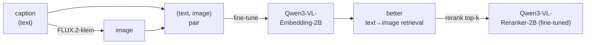

<!-- Language: **English** | [日本語](README.ja.md) -->

# Qwen3-VL Multimodal Embedding Fine-tuning Demo

A minimal, end-to-end demo that shows how **synthetic data alone can improve image retrieval**.

1. 🎨 **Generate data** — use the text-to-image model [FLUX.2-klein-4B](https://huggingface.co/black-forest-labs/FLUX.2-klein-4B) to synthesize a captioned image dataset (each caption *is* the ground-truth query for its image)
2. 📐 **Baseline eval** — measure text→image retrieval quality (NDCG / Recall@k) of [Qwen3-VL-Embedding-2B](https://huggingface.co/Qwen/Qwen3-VL-Embedding-2B)
3. 🔧 **Fine-tune** — adapt the embedding model to the synthetic pairs with [Sentence Transformers](https://sbert.net)
4. 📈 **Re-eval** — compare retrieval quality before vs after fine-tuning
5. 🥇 **Rerank** — fine-tune [Qwen3-VL-Reranker-2B](https://huggingface.co/Qwen/Qwen3-VL-Reranker-2B) and rerank the top candidates



> **Why it's neat:** **no human annotation needed.** The image-generation prompt
> doubles as a labelled query, so you can mint training data for a retrieval
> model essentially for free.

> 📖 The detailed design docs under [`docs/`](docs/) are written in Japanese.
> A Japanese version of this README is available at [README.ja.md](README.ja.md).

---

## Examples

**Synthetic dataset** — captioned images generated by FLUX.2-klein (each caption is the
ground-truth query for its image):


**Text→image retrieval, before vs after fine-tuning** — top results for the same query;
green border = a correct match. Fine-tuning pulls the right images up:


**Gradio viewer** — browse the dataset and compare metrics interactively:


> These images are **generated from your own run**, not committed to the repo. After
> `make all`, run `make figures` for the two plots and capture the Gradio screenshots —
> see [`docs/images/README.md`](docs/images/README.md).

---

## Documentation

Detailed docs live under [`docs/`](docs/) (Japanese).

| Doc | Contents |
|---|---|
| [Architecture](docs/architecture.md) | Overall structure, module dependencies, data flow, profile design |
| [Specification](docs/specification.md) | Goals & scope, models used, requirements, config/CLI/output specs, metrics |
| [How it works](docs/how-it-works.md) | The "what / why / how" of data generation, training, evaluation, reranking |

---

## Requirements

Real training and generation **require a CUDA GPU**. The default settings target
an **NVIDIA RTX 4060 Ti 16GB (Ada generation)**.

- bf16 (native on Ada) + gradient checkpointing + small batches to fit in 16GB
- `flash_attention_2` (falls back automatically to `sdpa` if not installed)
- Disk: ~10+ GB for model caches (FLUX.2-klein-4B + Qwen3-VL 2B ×2)

If you don't have a GPU, a [smoke test](#smoke-test-no-gpu) verifies the wiring on CPU.

---

## Setup

This project uses [`uv`](https://docs.astral.sh/uv/).

```bash
uv sync                      # install dependencies
uv sync --extra gpu          # + flash-attn (recommended on CUDA GPU)
```

> **GPU / platform note:** `[tool.uv.sources]` in `pyproject.toml` pins
> `torch` / `torchvision` to the **CUDA 12.6 build (`pytorch-cu126`) on Linux**.
> For a different CUDA version, CPU-only, or macOS, install an appropriate
> `torch` first or override that setting.
> `--extra gpu` installs `flash-attn`; without it the code falls back to `sdpa`
> automatically, but performance will be lower.

---

## Usage

```bash
make all                     # full pipeline (GPU recommended)
```

This runs the following in order (each can also be run individually):

| Target | What it does |
|---|---|
| `make data`            | generate data with FLUX.2-klein → `data/{train,eval}` |
| `make eval-base`       | base model retrieval quality → `outputs/metrics_base.json` |
| `make train`           | fine-tune the embedding model → `outputs/model/` |
| `make eval`            | fine-tuned retrieval quality → `outputs/metrics_finetuned.json` |
| `make train-reranker`  | fine-tune the reranker → `outputs/reranker/` |
| `make rerank`          | **6-way evaluation** (embedding {base,ft} × reranker {base,ft,none}) → `outputs/rerank_metrics.json` + examples |

Afterwards, compare `metrics_base.json` vs `metrics_finetuned.json` (embedding
only), and `rerank_metrics.json` for the six two-stage combinations
(embedding {base,ft} × reranker {base,ft,none}, where `none` is the
embedding-only reference) — NDCG / Recall / MRR.

### Visualize the results (Gradio)

A read-only viewer for the generated artifacts (metrics, dataset, rerank results)
is included.

```bash
uv run python app.py        # → http://localhost:7860
```

Tabs: **📊 Metrics** (embedding base vs fine-tuned bar chart + delta table) /
**🖼️ Dataset** (browse generated images + captions) /
**🔄 Reranking** (rank before/after) /
**🔀 Two-stage (6 patterns)** (embedding × reranker comparison; chart shows the
main 4 combos, table shows all 6).
Switch between `outputs` and `outputs_smoke`.

### Reproducible runs (DVC, optional)

A [DVC](https://dvc.org/) pipeline ([`dvc.yaml`](dvc.yaml)) declares each stage's
deps and outputs, so it re-runs **only the stages that changed**.

```bash
uv run dvc repro            # reproduce the pipeline with dependency tracking
uv run dvc metrics show     # list metrics_*.json
```

Both `default` and `smoke` profiles are expanded from one definition (`foreach`).

### Changing the configuration

Edit `configs/default.yaml` (number of samples, batch size, model IDs, image
token caps, etc.). To use a different file, pass `--config path/to.yaml` to any command.

```bash
uv run python -m qwen3vl_demo.train --config configs/default.yaml
```

---

## Choosing the image-generation model (full vs fp8)

Image generation is loaded via `AutoPipelineForText2Image`, so **any diffusers
text-to-image model** can be set as `image_gen.model_id`. Two presets are provided,
both [FLUX.2-klein](https://huggingface.co/black-forest-labs/FLUX.2-klein-4B)
(Apache-2.0, step-distilled rectified-flow):

| Preset | Model | License | VRAM | Recommended settings |
|---|---|---|---|---|
| `default` | [FLUX.2-klein-4B](https://huggingface.co/black-forest-labs/FLUX.2-klein-4B) | Apache-2.0 | full bf16 | steps=4, guidance=1.0 |
| `flux` | [FLUX.2-klein-4b-fp8](https://huggingface.co/black-forest-labs/FLUX.2-klein-4b-fp8) | Apache-2.0 | ~4 GB (fp8) | steps=4, guidance=1.0 |

```bash
make data PROFILE=flux        # generate with the fp8 checkpoint (use PROFILE=flux for later stages too)
```

- **Both presets are Apache-2.0**, so there are no commercial restrictions.
- The fp8 preset keeps VRAM low (~4 GB) but ships a single-file checkpoint; if
  `AutoPipelineForText2Image` can't load `black-forest-labs/FLUX.2-klein-4b-fp8`
  in your diffusers version, point `image_gen.model_id` in `configs/flux.yaml` at
  the diffusers-format mirror
  [`Photoroom/FLUX.2-klein-4b-fp8-diffusers`](https://huggingface.co/Photoroom/FLUX.2-klein-4b-fp8-diffusers).
- Loading FLUX.2 needs a **recent `diffusers` with FLUX.2 support** — upgrade if needed.

---

## Smoke test (no GPU)

Verify the pipeline wiring (data format, Trainer, Evaluator, outputs) on CPU
without downloading the heavy models.

```bash
make smoke
```

In the smoke profile (`configs/smoke.yaml`):

- image generation is replaced by **synthetic stub images** (a solid color derived from the caption hash)
- the embedding model is the small **`sentence-transformers/clip-ViT-B-32`** (CPU-friendly)
- reranking (training and inference) is **skipped** (no small multimodal cross-encoder exists)

⚠️ The smoke test is **for wiring verification only** — its numbers are meaningless.
For real metrics, run `make all` on a GPU.

---

## Development (tests & lint)

The pure-Python parts (caption generation, config loading, stub images, negative
mining) have lightweight unit tests that run without a GPU or heavy models. CI
(GitHub Actions) runs ruff and pytest on CPU.

```bash
make test      # pytest (pure-Python, no GPU)
make lint      # ruff
```

See [CONTRIBUTING.md](CONTRIBUTING.md) for how to contribute.

---

## How captions are generated

Training captions are synthesized in
[`src/qwen3vl_demo/prompts.py`](src/qwen3vl_demo/prompts.py) by combining
**hand-written word lists × sentence templates** (no external deps, reproducible by seed).

- `SUBJECTS` (subjects with categories: animal / vehicle / food / scene / object)
- `ADJECTIVES`, `SETTINGS`, `TEMPLATES`

Example: `"a fluffy photo of a cat on a wooden table"`. This exact string is used
as both (1) the FLUX.2-klein prompt and (2) the ground-truth retrieval query.
Counts and seeds are config-driven; train and eval use different seeds so their
captions never overlap.

---

## Layout

```
qwen3-vl-demo/
├── src/qwen3vl_demo/
│   ├── config.py          # YAML -> dataclass, --config / --profile
│   ├── prompts.py         # template-combination caption generation
│   ├── generate_data.py   # FLUX.2-klein (or stub) image generation → datasets
│   ├── models.py          # embedding model loading (with attn fallback)
│   ├── evaluate.py        # InformationRetrievalEvaluator → NDCG/Recall
│   ├── train.py           # fine-tune embeddings with MultipleNegativesRankingLoss
│   ├── train_reranker.py  # fine-tune the reranker (negative mining + BCE)
│   └── rerank.py          # embedding retrieval top-k → reranker
├── app.py                 # Gradio results viewer
├── tests/                 # pure-Python unit tests (pytest)
├── configs/               # default.yaml (real) / smoke.yaml (CPU wiring check)
├── docs/                  # architecture / specification / how-it-works (Japanese)
├── dvc.yaml               # DVC pipeline definition
└── Makefile               # per-stage run targets
```

See [Architecture](docs/architecture.md) for module responsibilities and dependencies.

---

## Results (example / fill-in)

After running `make all` on a GPU, record your measured numbers here.

| Model | NDCG@10 | Recall@1 | Recall@10 |
|---|---|---|---|
| Base (Qwen3-VL-Embedding-2B) | _TBD_ | _TBD_ | _TBD_ |
| Fine-tuned | _TBD_ | _TBD_ | _TBD_ |
| + Reranker-2B | _TBD_ | _TBD_ | _TBD_ |

For reference, the official Sentence Transformers Visual Document Retrieval
example reports fine-tuning this model improving NDCG@10 from 0.888 → 0.947.

---

## License

The **code in this repository is MIT licensed** ([LICENSE](LICENSE)).

However, the **models you download have their own licenses**, which may also
apply to their outputs. Always check each model card before use.

| Model | License | Note |
|---|---|---|
| [Qwen3-VL-Embedding-2B](https://huggingface.co/Qwen/Qwen3-VL-Embedding-2B) | Apache-2.0 | permissive |
| [Qwen3-VL-Reranker-2B](https://huggingface.co/Qwen/Qwen3-VL-Reranker-2B) | Apache-2.0 | permissive |
| [FLUX.2-klein-4B](https://huggingface.co/black-forest-labs/FLUX.2-klein-4B) (image gen, default) | Apache-2.0 | permissive; terms may apply to generated images |
| [FLUX.2-klein-4b-fp8](https://huggingface.co/black-forest-labs/FLUX.2-klein-4b-fp8) (image gen, `flux` preset) | Apache-2.0 | permissive; fp8 variant for lower VRAM |
| CLIP (`clip-ViT-B-32`, smoke only) | MIT | permissive |

> ℹ️ **Note:** every model in this demo (FLUX.2-klein for image generation,
> Qwen3-VL embedding/reranker) is **Apache-2.0**, so there are no commercial
> revenue restrictions. Still, check each model card, as terms may apply to
> generated outputs.
