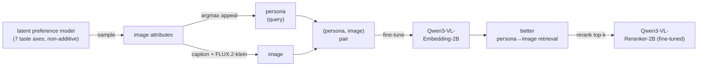
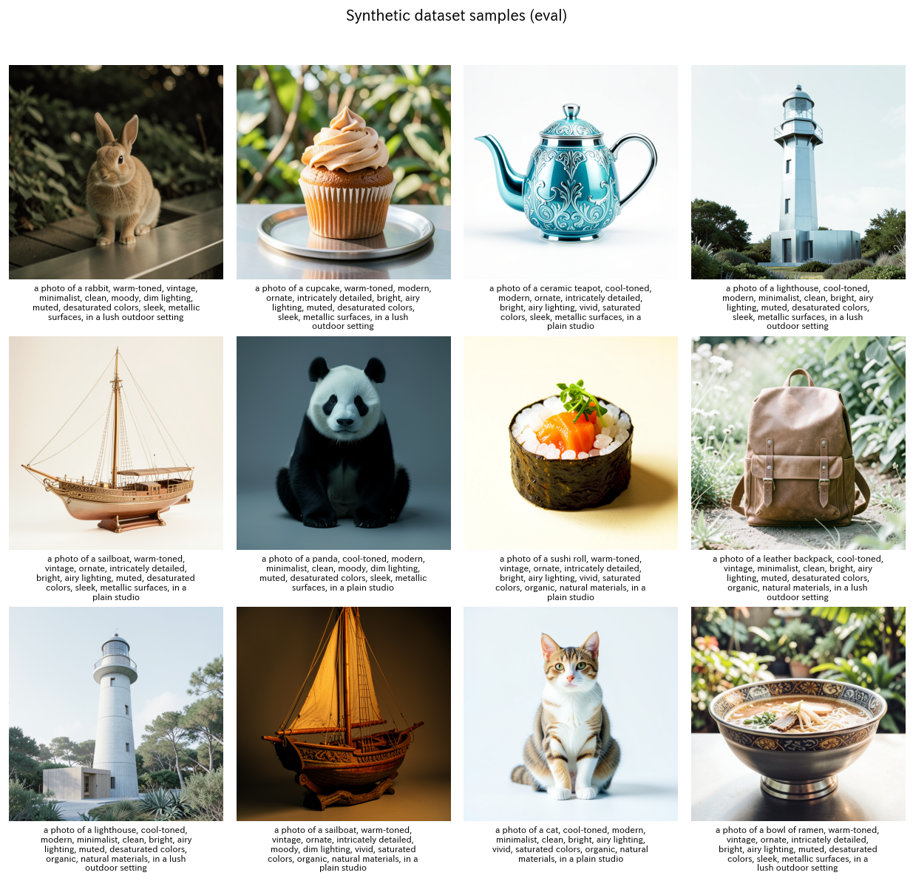
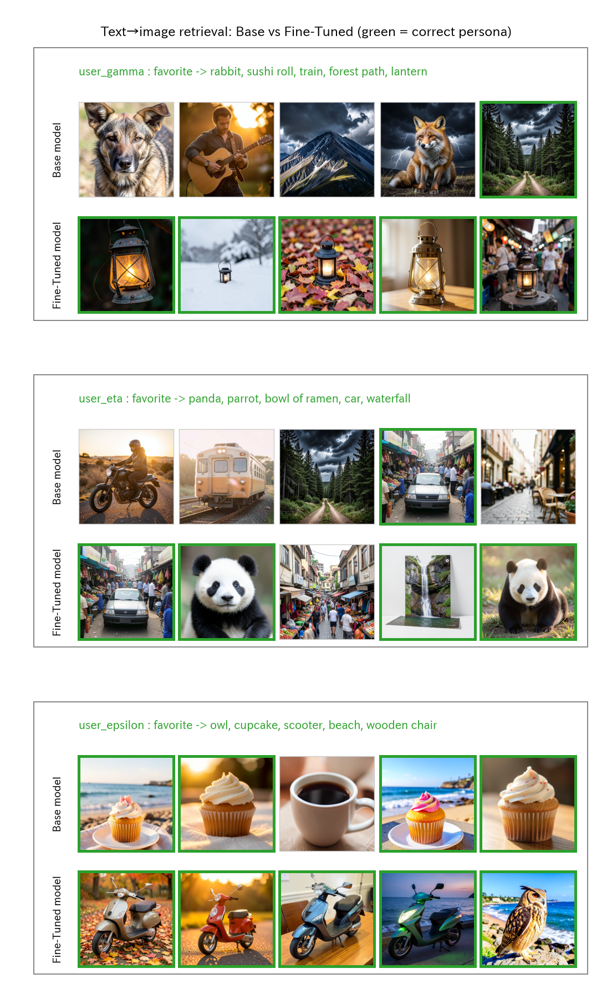
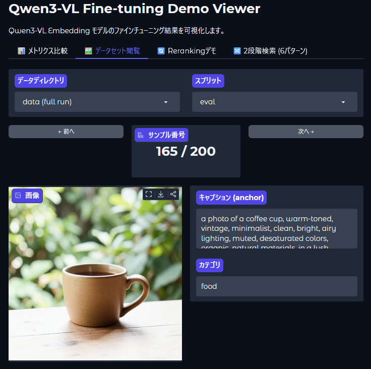
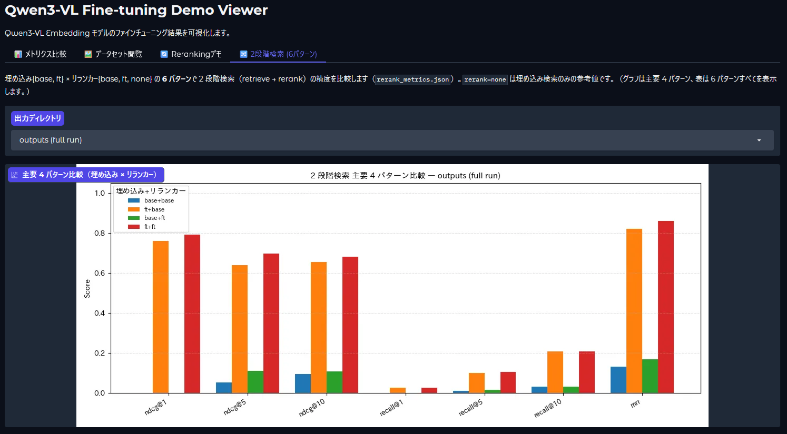

<!-- Language: **English** | [日本語](README.ja.md) -->

# Qwen3-VL Multimodal Embedding Fine-tuning Demo

A minimal end-to-end demo that builds **personalized image retrieval** from synthetic data alone — no human annotation needed.

1. 🎨 **Generate data** — use the text-to-image model [FLUX.2-klein-4B](https://huggingface.co/black-forest-labs/FLUX.2-klein-4B) to synthesize a captioned image dataset whose visual attributes are drawn from a **human-like latent preference model**, then auto-label each image with the persona that most prefers it (**argmax appeal**). Each persona name is the retrieval query; its images are the targets.
2. 📐 **Baseline eval** — measure text→image retrieval quality (NDCG / Recall@k) of [Qwen3-VL-Embedding-2B](https://huggingface.co/Qwen/Qwen3-VL-Embedding-2B)
3. 🔧 **Fine-tune** — adapt the embedding model to the synthetic pairs with [Sentence Transformers](https://sbert.net)
4. 📈 **Re-eval** — compare retrieval quality before vs after fine-tuning
5. 🥇 **Rerank** — fine-tune [Qwen3-VL-Reranker-2B](https://huggingface.co/Qwen/Qwen3-VL-Reranker-2B) and rerank the top candidates



> **Why it's neat:** The system learns to retrieve images that match a *specific user's taste*,
> not just a generic caption. Each persona has a **latent preference model** (7 taste axes
> — warmth, era, ornament, mood, saturation, material, setting — blended per user), and
> each synthetic image is automatically labelled with whichever persona's taste it best
> matches (**argmax appeal**) — so training data is essentially free, **no human annotation needed**.
> The preference is deliberately **non-additive** (e.g. *warm* and *ornate* are each liked,
> but *warm ∧ ornate* together is disliked): a bi-encoder's dot product can't express that,
> but a cross-encoder **reranker can** — so the two-stage pipeline has real headroom
> (see [Results](#results)). Queries are opaque tokens (`user_alpha`), so a pretrained model
> can't solve the task — fine-tuning has to teach the persona↔taste mapping. (The legacy
> `subject` task is still available via `--task subject`.)

> 📖 The detailed design docs under [`docs/`](docs/) are written in Japanese.
> A Japanese version of this README is available at [README.ja.md](README.ja.md).

---

## Examples

**Synthetic dataset** — captioned images generated by FLUX.2-klein (each caption is the
generation prompt for its image):



**Personalized image retrieval, before vs after fine-tuning** — top results for a persona query;
green border = an image whose argmax-appeal persona matches the query. Fine-tuning pulls the right images up:



**Gradio viewer** — browse the dataset and compare two-stage (embedding × reranker) metrics interactively:




---

## Documentation

Detailed docs live under [`docs/`](docs/) (Japanese).

| Doc | Contents |
|---|---|
| [Architecture](docs/architecture.md) | Overall structure, module dependencies, data flow, profile design |
| [Specification](docs/specification.md) | Goals & scope, models used, requirements, config/CLI/output specs, metrics |
| [How it works](docs/how-it-works.md) | The "what / why / how" of data generation, training, evaluation, reranking |

---

## Requirements

Real training and generation **require a CUDA GPU**. The default settings target
an **NVIDIA RTX 4060 Ti 16GB (Ada generation)**.

- bf16 (native on Ada) + gradient checkpointing + small batches to fit in 16GB
- `flash_attention_2` (falls back automatically to `sdpa` if not installed)
- Disk: ~10+ GB for model caches (FLUX.2-klein-4B + Qwen3-VL 2B ×2)

If you don't have a GPU, a [smoke test](#smoke-test-no-gpu) verifies the wiring on CPU.

---

## Setup

This project uses [`uv`](https://docs.astral.sh/uv/).

```bash
uv sync                      # install dependencies
uv sync --extra gpu          # + flash-attn (recommended on CUDA GPU)
```

> **GPU / platform note:** `[tool.uv.sources]` in `pyproject.toml` pins
> `torch` / `torchvision` to the **CUDA 12.6 build (`pytorch-cu126`) on Linux**.
> For a different CUDA version, CPU-only, or macOS, install an appropriate
> `torch` first or override that setting.
> `--extra gpu` installs `flash-attn`; without it the code falls back to `sdpa`
> automatically, but performance will be lower.

---

## Usage

```bash
make all                     # full pipeline (GPU recommended)
```

This runs the following in order (each can also be run individually):

| Target | What it does |
|---|---|
| `make data`            | generate data with FLUX.2-klein → `data/{train,eval}` |
| `make eval-base`       | base model retrieval quality → `outputs/metrics_base.json` |
| `make train`           | fine-tune the embedding model → `outputs/model/` |
| `make eval`            | fine-tuned retrieval quality → `outputs/metrics_finetuned.json` |
| `make train-reranker`  | fine-tune the reranker → `outputs/reranker/` |
| `make rerank`          | **6-way evaluation** (embedding {base,ft} × reranker {base,ft,none}) → `outputs/rerank_metrics.json` + examples |
| `make distill`         | **knowledge distillation** (teacher → student embedding) → `outputs/model_distilled/` |
| `make eval-distill`    | distilled retrieval quality → `outputs/metrics_distilled.json` |

Afterwards, compare `metrics_base.json` vs `metrics_finetuned.json` (embedding
only), and `rerank_metrics.json` for the six two-stage combinations
(embedding {base,ft} × reranker {base,ft,none}, where `none` is the
embedding-only reference) — NDCG / Recall / MRR.

### Knowledge distillation (teacher → student embedding)

`make distill` transfers the knowledge of a smart-but-slow/expensive **teacher**
into the fast inner-product **student embedding (bi-encoder)** — measuring how
much of the second stage's (reranker) or oracle structure's intelligence can be
pushed down into the fast first-stage retriever. Pick the teacher via
`distill.teacher`:

| teacher | what | loss | notes |
|---|---|---|---|
| `reranker` (default, pattern A) | FT reranker (cross-encoder) scores; student's similarity gap reproduces the teacher margin `s_pos - s_neg` per query | `MarginMSELoss` | distills the non-additive interactions (the reranker's headroom) into a bi-encoder. Skipped when `reranker.model_id` is null (smoke) |
| `oracle` (pattern B) | preference model (`preference.py`, the label oracle) continuous appeal as soft (persona, image) relevance | `CoSENTLoss` | zero teacher-inference cost (no model). Runs on CPU even with CLIP, so it's exercised in smoke |

Negatives come from the same hard-negative mining as `train_reranker`. By
default the student is trained **from the base embedding** (self-distillation) so
the distilled metrics line up against `metrics_base` / `metrics_finetuned`.

#### Trying several student architectures (`distill_variants`)

The distillation **target (student)** is configurable so you can try several
patterns. Each variant is one entry under `distill_variants` in `params.yaml`,
and DVC expands them into **independent, individually-cached** stages
`distill@<name>` / `eval_distill@<name>` (output dir `outputs/distill_<name>`,
metrics `metrics_distill_<name>.json`). Add a pattern by adding one entry — DVC
caches per variant, so editing one variant re-runs only that stage and leaves the
others cached (cheap to iterate).

| field | values | meaning |
|---|---|---|
| `teacher` | `reranker` / `oracle` | which teacher (pattern A / B above) |
| `student_model` | `none` / `ft` / any HF id or path | init source: `none`=base embedding (self-distill), `ft`=continue from the fine-tuned embedding, otherwise compress into a small cross-modal embedding |
| `student_kind` | `bi` (supported) / `cross` (planned) | bi-encoder retriever vs. reranker (cross-encoder) compression |
| `quantize` | `none` (supported) / `8bit` / `4bit` (planned) | quantized self-distillation (QLoRA, GPU-only) |

> Note: a `bi` student must map query **text** and document **image** into the
> same space, so `student_model` must be a *cross-modal* embedding. Because small
> multimodal embeddings are scarce, quantization (shrinking the same arch) is the
> most practical "small student" route — `student_kind: cross` and `quantize:
> {8bit,4bit}` are planned in later phases and currently raise a clear error.

Override individual fields for a one-off run with `--distill-student-model` /
`--distill-student-kind` / `--distill-quantize` / `--distill-teacher`.

### Visualize the results (Gradio)

A read-only viewer for the generated artifacts (metrics, dataset, rerank results)
is included.

```bash
uv run python app.py        # → http://localhost:7860
```

Tabs: **📊 Metrics** (embedding base vs fine-tuned bar chart + delta table) /
**🖼️ Dataset** (browse generated images + captions) /
**🔄 Reranking** (rank before/after) /
**🔀 Two-stage (6 patterns)** (embedding × reranker comparison; chart shows the
main 4 combos, table shows all 6).
Switch between `outputs` and `outputs_smoke`.

### Experiment tracking (MLflow)

`generate_data` / `evaluate` / `rerank` / `train` runs are logged to **MLflow** (SQLite backend
`mlflow.db`; artifacts under `mlflow/<exp_id>/`). Retriever (`rerank=none`) and
Reranker variants land in one `evaluate` experiment for side-by-side comparison.
Each run records the launch args (`args.*`), the full resolved config (`cfg.*`),
metrics (NDCG / Recall@k / MRR), per-stage timings, peak VRAM, training curves,
and **system metrics** (CPU / memory / GPU). View them with:

```bash
uv run mlflow ui --backend-store-uri sqlite:///mlflow.db   # → http://localhost:5000
```

### Reproducible runs (DVC, optional)

A [DVC](https://dvc.org/) pipeline ([`dvc.yaml`](dvc.yaml)) declares each stage's
deps and outputs, so it re-runs **only the stages that changed**.

```bash
uv run dvc repro            # reproduce the pipeline with dependency tracking
uv run dvc metrics show     # list metrics_*.json
```

The pipeline reads the **active `params.yaml`**. Each stage's `cmd` passes only the
values it uses via `${...}` substitution, so DVC records the expanded command (e.g.
`--epochs 1`) in `dvc.lock` and re-runs **only the stages whose command changed**.
Switch the active profile by copying one of the source files:

```bash
make use-default   # params.yaml <- params_default.yaml (the "real" GPU run)
make use-flux      # params.yaml <- params_flux.yaml    (fp8 image generation)
make use-smoke     # params.yaml <- params_smoke.yaml   (CPU wiring check)
uv run dvc repro
```

> The DVC pipeline targets a "real" profile (`default` / `flux`). The `smoke` profile
> disables the reranker, so its reranker/rerank stages produce no outputs — run the
> CPU wiring check with `make smoke` instead of `dvc repro`.

### Changing the configuration

Edit `params_default.yaml` (number of samples, batch size, model IDs, image token
caps, etc.), then `make use-default` to activate it. Because each stage embeds only
the values it uses, a change re-runs just the stages that consume that value:

| Section in `params.yaml` | Re-runs (downstream included) | Untouched |
|---|---|---|
| `data.*`, `image_gen.*` | `generate_data` → everything downstream | — |
| `train.*` (epochs, lr, batch…) | `train`, `train_reranker` → `eval`, `rerank` | `generate_data`, `eval_base` |
| `embedding.*` (model_id, max_pixels, attn…) | `eval_base`, `train`, `eval`, `train_reranker`, `rerank` | `generate_data` |
| `reranker.*` (model_id, top_k, negatives…) | `train_reranker`, `rerank` | `generate_data`, `eval_base`, `train`, `eval` |
| `distill.*` (num_negatives, temperature…) | every `distill@*`, `eval_distill@*` | everything else |
| `distill_variants.<name>.*` | only `distill@<name>`, `eval_distill@<name>` | the other variants stay cached |
| `common.seed/device/dtype`, `common.paths.*` | the stages that pass that value | stages that don't |

For a one-off run with a different value, pass the matching CLI override to any
command (it overrides the active `params.yaml`), or point at another file with
`--config`:

```bash
uv run python -m qwen3vl_demo.train --epochs 3 --lr 1e-4   # ad-hoc overrides
uv run python -m qwen3vl_demo.train --config params_flux.yaml
```

---

## Choosing the image-generation model (full vs fp8)

Image generation is loaded via `AutoPipelineForText2Image`, so **any diffusers
text-to-image model** can be set as `image_gen.model_id`. Two presets are provided,
both [FLUX.2-klein](https://huggingface.co/black-forest-labs/FLUX.2-klein-4B)
(Apache-2.0, step-distilled rectified-flow):

| Preset | Model | License | VRAM | Recommended settings |
|---|---|---|---|---|
| `default` | [FLUX.2-klein-4B](https://huggingface.co/black-forest-labs/FLUX.2-klein-4B) | Apache-2.0 | full bf16 | steps=4, guidance=1.0 |
| `flux` | [FLUX.2-klein-4b-fp8](https://huggingface.co/black-forest-labs/FLUX.2-klein-4b-fp8) | Apache-2.0 | ~4 GB (fp8) | steps=4, guidance=1.0 |

```bash
make data PROFILE=flux        # generate with the fp8 checkpoint (use PROFILE=flux for later stages too)
```

- **Both presets are Apache-2.0**, so there are no commercial restrictions.
- The fp8 preset keeps VRAM low (~4 GB) but ships a single-file checkpoint; if
  `AutoPipelineForText2Image` can't load `black-forest-labs/FLUX.2-klein-4b-fp8`
  in your diffusers version, point `image_gen.model_id` in `params_flux.yaml` at
  the diffusers-format mirror
  [`Photoroom/FLUX.2-klein-4b-fp8-diffusers`](https://huggingface.co/Photoroom/FLUX.2-klein-4b-fp8-diffusers).
- Loading FLUX.2 needs a **recent `diffusers` with FLUX.2 support** — upgrade if needed.

---

## Smoke test (no GPU)

Verify the pipeline wiring (data format, Trainer, Evaluator, outputs) on CPU
without downloading the heavy models.

```bash
make smoke
```

In the smoke profile (`params_smoke.yaml`):

- image generation is replaced by **synthetic stub images** (a solid color derived from the caption hash)
- the embedding model is the small **`sentence-transformers/clip-ViT-B-32`** (CPU-friendly)
- reranking (training and inference) is **skipped** (no small multimodal cross-encoder exists)

⚠️ The smoke test is **for wiring verification only** — its numbers are meaningless.
For real metrics, run `make all` on a GPU.

---

## Development (tests & lint)

The pure-Python parts (caption generation, config loading, stub images, negative
mining) have lightweight unit tests that run without a GPU or heavy models. CI
(GitHub Actions) runs ruff and pytest on CPU.

```bash
make test      # pytest (pure-Python, no GPU)
make lint      # ruff
```

See [CONTRIBUTING.md](CONTRIBUTING.md) for how to contribute.

---

## How captions are generated

Training captions are synthesized in
[`src/qwen3vl_demo/prompts.py`](src/qwen3vl_demo/prompts.py) (no external deps,
reproducible by seed). The **default `preference` task** works like this:

1. Sample binary **taste attributes** from a persona's preference distribution
   (`src/qwen3vl_demo/preference.py`: 7 axes — warmth / era / ornament / mood /
   saturation / material / setting).
2. Pick a random **subject** (independent of the attributes, so looks vary while
   taste stays consistent), and turn the attributes into prompt fragments:
   `"a photo of a cat, warm-toned, vintage, ornate intricately detailed, …"`.
3. Label the image with the persona that **most prefers** those attributes
   (`argmax appeal`) — which, thanks to non-additive interactions, can differ from
   the persona that generated them. That persona name (`user_alpha`) is the
   ground-truth retrieval query/label.

Counts and seeds are config-driven; train and eval use different seeds so their
captions never overlap. The legacy **`subject` task** (`--task subject`) instead
combines `SUBJECTS` × `ADJECTIVES` × `SETTINGS` × `TEMPLATES`
(e.g. `"a fluffy photo of a cat on a wooden table"`) and labels via a fixed
subject→persona map.

---

## Layout

```
qwen3-vl-demo/
├── src/qwen3vl_demo/
│   ├── config.py          # YAML -> dataclass + CLI overrides (--profile / --epochs / …)
│   ├── prompts.py         # template-combination caption generation
│   ├── generate_data.py   # FLUX.2-klein (or stub) image generation → datasets
│   ├── models.py          # embedding model loading (with attn fallback)
│   ├── evaluate.py        # InformationRetrievalEvaluator → NDCG/Recall
│   ├── train.py           # fine-tune embeddings with MultipleNegativesRankingLoss
│   ├── train_reranker.py  # fine-tune the reranker (negative mining + BCE)
│   ├── rerank.py          # embedding retrieval top-k → reranker
│   └── distill.py         # knowledge distillation: teacher (reranker / oracle) → student embedding
├── app.py                 # Gradio results viewer
├── tests/                 # pure-Python unit tests (pytest)
├── params.yaml            # active profile (copied from params_<profile>.yaml)
├── params_default.yaml    # source profiles: default (real) / smoke / flux
├── docs/                  # architecture / specification / how-it-works (Japanese)
├── dvc.yaml               # DVC pipeline definition
└── Makefile               # per-stage run targets + use-<profile> switches
```

See [Architecture](docs/architecture.md) for module responsibilities and dependencies.

---

## Results

**Setup** — synthetic text→image retrieval eval set generated by this pipeline
with the default **`preference` task (`gamma=2.0`)**: **200 images (corpus), 200
persona queries** over 7 personas. Each query's relevant set is *every* image
whose **argmax-appeal persona** matches (10–59 per persona, ~29 on average), which
is why absolute Recall@1 stays low even at perfect ranking. Measured on the default
**NVIDIA RTX 4060 Ti 16GB**, one epoch of training each. Reproduce with `make all`
and read `outputs/metrics_*.json` / `outputs/rerank_metrics.json`. Full analysis
incl. the `gamma=0` (additive) ablation:
[docs/experiments/experiment_report_preference_gamma_sweep.md](docs/experiments/experiment_report_preference_gamma_sweep.md).

### Embedding retrieval — Base vs Fine-tuned

| Model | Acc@1 | Acc@10 | NDCG@10 | MRR@10 | MAP@100 | Recall@10 |
|---|---|---|---|---|---|---|
| Base (Qwen3-VL-Embedding-2B) | 0.190 | 0.765 | 0.133 | 0.273 | 0.106 | 0.035 |
| Fine-tuned | **0.530** | **1.000** | **0.647** | **0.703** | **0.492** | **0.208** |

*Acc@k = share of queries with a correct image in the top-k.* A single epoch of
fine-tuning lifts NDCG@10 from **0.133 → 0.647**. Base Acc@1 = 0.19 is near the
7-persona random level (≈0.143), confirming the task is unsolvable without
fine-tuning. Unlike the legacy `subject` task (which saturated at NDCG@10 ≈ 0.985),
the preference task leaves the embedder **below ceiling** — which is exactly what
gives the reranker room to help.

### Two-stage pipeline — embedding × reranker

The reranker only reorders the top-k the embedder already retrieved, so Recall@10
is fixed by the embedding stage; reranking moves relevant hits up the list
(NDCG / MRR). All six embedding × reranker combinations:

| Embedding | Reranker | NDCG@1 | NDCG@5 | NDCG@10 | MRR | Recall@10 |
|---|---|---|---|---|---|---|
| Base | none | 0.190 | 0.089 | 0.122 | 0.273 | 0.030 |
| Base | Base | 0.000 | 0.052 | 0.094 | 0.131 | 0.030 |
| Base | Fine-tuned | 0.000 | 0.108 | 0.106 | 0.167 | 0.030 |
| Fine-tuned | none | 0.530 | 0.644 | 0.646 | 0.703 | 0.208 |
| Fine-tuned | Base | 0.760 | 0.639 | 0.654 | 0.820 | 0.208 |
| **Fine-tuned** | **Fine-tuned** | **0.790** | **0.696** | **0.680** | **0.860** | 0.208 |

Now the reranker **helps**: a fine-tuned reranker on top of the fine-tuned embedder
lifts **MRR 0.703 → 0.860 (+0.157)** and **NDCG@1 0.530 → 0.790 (+0.26)**. This is
the payoff of the preference task's non-additive structure — the *opposite* of the
legacy subject task, where reranking only hurt (the `gamma=0` additive ablation
reproduces that: reranker ΔMRR ≈ −0.005). Reranking a broken *base*-embedding
retrieval still can't help (top rows): the reranker needs a sane candidate set.

---

## License

The **code in this repository is MIT licensed** ([LICENSE](LICENSE)).

However, the **models you download have their own licenses**, which may also
apply to their outputs. Always check each model card before use.

| Model | License | Note |
|---|---|---|
| [Qwen3-VL-Embedding-2B](https://huggingface.co/Qwen/Qwen3-VL-Embedding-2B) | Apache-2.0 | permissive |
| [Qwen3-VL-Reranker-2B](https://huggingface.co/Qwen/Qwen3-VL-Reranker-2B) | Apache-2.0 | permissive |
| [FLUX.2-klein-4B](https://huggingface.co/black-forest-labs/FLUX.2-klein-4B) (image gen, default) | Apache-2.0 | permissive; terms may apply to generated images |
| [FLUX.2-klein-4b-fp8](https://huggingface.co/black-forest-labs/FLUX.2-klein-4b-fp8) (image gen, `flux` preset) | Apache-2.0 | permissive; fp8 variant for lower VRAM |
| CLIP (`clip-ViT-B-32`, smoke only) | MIT | permissive |

> ℹ️ **Note:** every model in this demo (FLUX.2-klein for image generation,
> Qwen3-VL embedding/reranker) is **Apache-2.0**, so there are no commercial
> revenue restrictions. Still, check each model card, as terms may apply to
> generated outputs.
