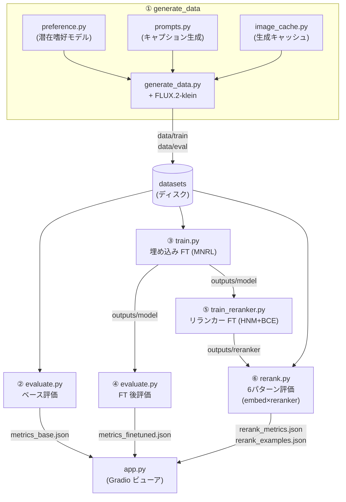
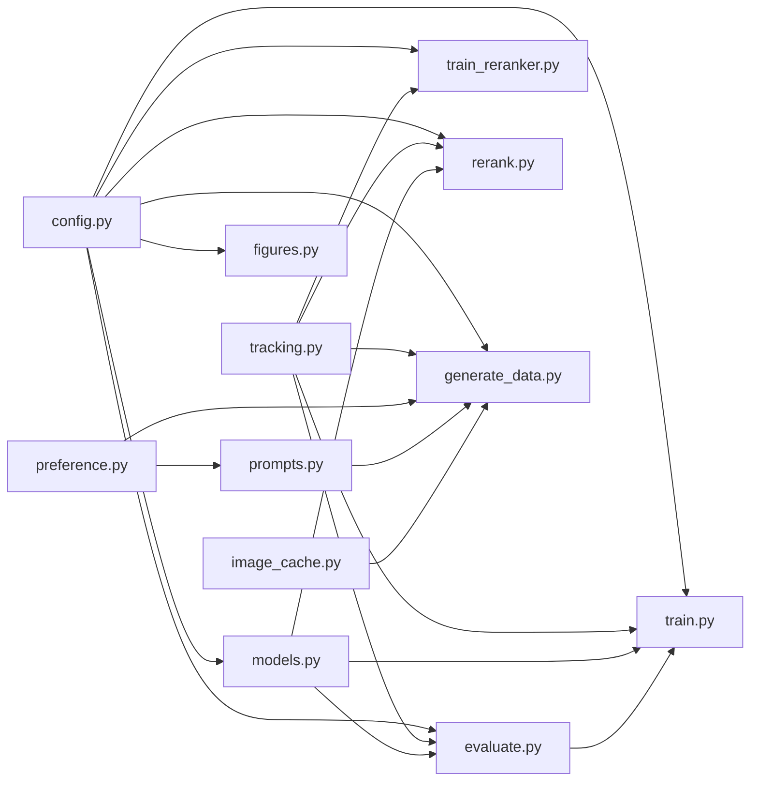

# アーキテクチャ

このドキュメントは、デモ全体の構造・モジュール間の依存関係・データの流れを説明します。
個々の処理の中身（なぜそうするのか）は [動作解説](how-it-works.md) を、設定値の意味は
[仕様](specification.md) を参照してください。

---

## 1. 全体像

パーソナライズ画像検索を合成データだけで学習させる一連の流れを 6 ステージに分割しています。
各ステージは独立した Python モジュールで、CLI（`python -m qwen3vl_demo.<module>`）として
単体実行できます。これらを **Makefile**（手軽に実行）または **DVC**（依存追跡つき再現実行）で束ねます。

---

## 2. モジュール構成と責務

| モジュール | 責務 | 主な入力 | 主な出力 |
|---|---|---|---|
| `config.py` | YAML 設定を dataclass に読み込み、CLI オーバーライド引数（`--profile` ＋ `--epochs` などセクション別）を提供 | `params*.yaml` ＋ CLI | `Config` オブジェクト |
| `preference.py` | 潜在嗜好モデルの定義・サンプリング・argmax-appeal 計算（7 嗜好軸・非加法交互作用） | `Config` | `PreferenceModel`, `list[Sample]` |
| `prompts.py` | preference モデルからキャプションを生成（preference タスク）、またはテンプレート組み合わせで生成（subject タスク） | `Config`, `PreferenceModel` | `list[Sample]` |
| `image_cache.py` | 同一入力の画像生成をスキップするファイルキャッシュ | キャプション＋seed | キャッシュ済み `PIL.Image` |
| `generate_data.py` | キャプションから画像を生成し datasets 化して保存 | `Config` | `data/train`, `data/eval` |
| `models.py` | 埋め込みモデルのロード（attention フォールバック付き） | `Config`, model_id | `SentenceTransformer` |
| `evaluate.py` | ペルソナ→画像検索の精度を IR 評価器で測定 | `data/eval`, モデル | `metrics_*.json` |
| `train.py` | MNRL で埋め込みモデルをファインチューニング | `data/train`, `Config` | `outputs/model` |
| `train_reranker.py` | Hard Negative Mining＋BCE でリランカーをファインチューニング | `data/train`, `Config` | `outputs/reranker` |
| `rerank.py` | 埋め込み検索 top-k を Reranker（base/ft）で再ランク、6 パターン評価 | `data/eval`, モデル | `rerank_metrics.json`, `rerank_examples.json` |
| `tracking.py` | MLflow へのメトリクス・設定・タイミング記録（全ステージ共通） | run 引数・metrics dict | MLflow run |
| `figures.py` | 結果可視化用図の生成（sample_grid / retrieval_before_after 等） | `data/`, `outputs/` | PNG 画像 |
| `app.py` | 成果物（メトリクス・データ・リランク結果）を Gradio で可視化 | `data/`, `outputs/` | Web UI |

### 依存関係（import グラフ）

ポイント:
- **`config.py` / `tracking.py`**: 全ステージが依存する共通基盤。設定解決と MLflow 記録を一元管理。
- **`models.py` の共通化**: 学習・評価・リランクで同じ手順でモデルをロードするため、ロード処理を 1 箇所に集約。
- **`evaluate.build_ir_evaluator` の再利用**: `train.py` が独自に評価器を組まず評価モジュールの実装を共有することで、学習中途中評価と最終評価の指標定義がズレない。
- **`preference.py`**: データ生成の中心。`prompts.py` が preference モデルを使ってキャプションを生成し、`generate_data.py` が argmax-appeal ラベリングに使用。

---

## 3. データの形（コントラクト）

各モジュールが受け渡す「データの形」を固定しておくことで、モジュールを差し替えやすくしています。

### データセット（`generate_data.py` → `evaluate.py` / `train.py`）

`datasets.Dataset` を `save_to_disk` で永続化。カラム:

| カラム | 型 | 意味 |
|---|---|---|
| `anchor` | `string` | キャプション（画像生成プロンプト）— 学習時は使用しない |
| `positive` | `Image` | レンダリングされた画像（＝検索ターゲット） |
| `category` | `string` | 被写体カテゴリ（animal/vehicle/food/scene/object） |
| `subject` | `string` | 被写体単語（`"cat"` 等）— カテゴリより細粒度 |
| `persona` | `string` | ペルソナ名（`"user_alpha"` 等）— FT と評価でのクエリに使用 |

> FT の学習では `persona` を anchor として使用（train.py が `persona` 列を `anchor` に置換）。
> `anchor` / `positive` という名前は Sentence Transformers の対照学習が期待する慣習に合わせています。

### メトリクス JSON（`evaluate.py` → `app.py`）

`InformationRetrievalEvaluator` が返す dict をそのまま保存。キーは
`synthetic-image-retrieval_cosine_<metric>`（例: `..._ndcg@10`）の形式。`app.py` は
この接頭辞を剥がして表示します。

### リランク事例 JSON（`rerank.py` → `app.py`）

各ペルソナ代表クエリについて `query` / `num_relevant` / `best_rank_before_rerank` / `best_rank_after_rerank` / `hits_in_topk_before` / `hits_in_topk_after` / `top_k` を記録した配列。マルチポジティブ設定に対応し、正解集合の中での最良順位と top-k 内ヒット数を記録する。

---

## 4. 実行の束ね方: Makefile と DVC

同じ CLI を 2 通りの方法で起動できます。

- **Makefile** … 手軽に叩く用。`make all` / `make smoke` / 各ステージ個別。
- **DVC**（`dvc.yaml`） … 依存追跡つきの再現実行用。各ステージの `deps`（ソース・入力データ）と
  `outs`/`metrics`（出力）を宣言してあり、`dvc repro` で **変更があったステージだけ** を再実行します。
  有効な `params.yaml` を読み、cmd 埋め込み方式で値を渡します（後述「DVC の依存粒度」）。
  プロファイルは `make use-default` / `use-smoke` / `use-flux` で切り替えます。

両者は同じ `python -m qwen3vl_demo.*` コマンドを呼ぶだけなので、挙動は一致します。

---

## 5. プロファイル: default と smoke

GPU の有無で実行内容を切り替えるために 2 つのプロファイル（= 2 つの YAML）を用意しています。

| 観点 | `default`（本番・GPU） | `smoke`（配線確認・CPU） |
|---|---|---|
| 画像生成 | FLUX.2-klein-4B で実生成 | スタブ画像（ハッシュ由来の単色） |
| 埋め込みモデル | Qwen3-VL-Embedding-2B | clip-ViT-B-32（小型・CPU 可） |
| リランカー | Qwen3-VL-Reranker-2B（FT＋推論） | なし（学習・推論ともスキップ） |
| 件数 | train 500 / eval 200 | train 8 / eval 4 |
| dtype / device | bf16 / cuda | float32 / cpu |

プロファイル分岐は基本的に **設定値の差**で表現し、コード分岐は最小限（スタブ画像の使用と
混合精度の有無くらい）に留めています。これにより「smoke で配線を確認 → default で本番」という
流れが、同じコードパスで保証されます。

プロファイルは `params_<name>.yaml` を増やすだけで追加できます。例として `flux`（`params_flux.yaml`）は
画像生成を VRAM 節約版の FLUX.2-klein-4b-fp8 に差し替えたプリセットで、直接実行は `--profile flux`、
DVC パイプラインでは `make use-flux`（`params.yaml` へコピー）で使えます。

### DVC の依存粒度（cmd 埋め込み方式）

DVC パイプラインは単一の有効 `params.yaml` を読み、各ステージの `cmd` が**自分が使う値だけ**を
`${...}` で展開して CLI に渡します。DVC は展開後の cmd（例: `--epochs 1`）を `dvc.lock` に記録するため、
**cmd 文字列の変化そのものが依存**として効きます。これにより:

* ある値を変えると、その値を cmd に持つステージ（と下流）だけが再実行される。たとえば `train.*`
  の変更で `generate_data` は再実行されない。
* `config.py` にフィールドを追加しても、値は CLI 経由で渡るため `config.py` を `deps` に置く必要がなく、
  無関係ステージの再実行を誘発しない。

そのため `dvc.yaml` に `params:` 宣言は書きません（二重管理が不要）。どの設定がどのステージを
再実行させるかは [仕様書](specification.md) と README の対応表を参照してください。
