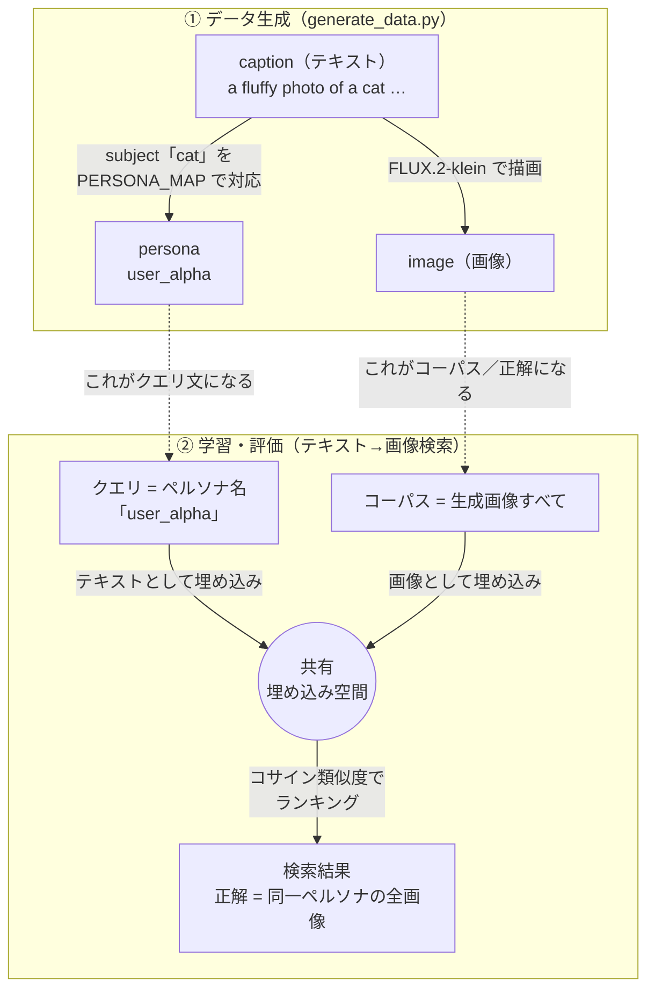

# 動作解説（データ生成・学習・評価）

各ステージが「何を・なぜ・どうやって」行うのかを掘り下げて説明します。
構造の俯瞰は [アーキテクチャ](architecture.md)、設定値の一覧は [仕様](specification.md) を参照してください。

このデモの根本アイデアは 1 つです:

> **画像生成プロンプトとペルソナ嗜好マップを組み合わせれば、人手アノテーションなしに
> 「正解ラベル付きの検索学習データ」を合成できる。**

text→image の画像生成では「テキスト（キャプション）から画像を作る」ので、キャプションと画像は
対応したペアになります。さらに各キャプションの被写体を**ペルソナ**（嗜好を持つ仮想ユーザー）に
対応づけることで、「ペルソナ名というクエリ」と「そのペルソナが好む画像群という正解」のペアが
自動で手に入ります。つまり **画像生成とペルソナ割り当てだけで検索の学習データを合成できる**
わけです。人手アノテーションなしに学習データをいくらでも作れる、というのがこのデモの肝です。

---

## データモデル: 何がクエリで、何が埋め込み対象か

このデモで最初に混乱しやすいのが「**何を埋め込んで、何で検索するのか**」です。要点は 3 つ:

- **クエリ**（検索の入力テキスト）＝ **ペルソナ名**（`"user_alpha"` など）
- **コーパス／埋め込み対象**（検索される側）＝ **生成画像**
- **キャプション** ＝ 画像を生成するためのプロンプト。被写体（subject）を介してペルソナを
  決める「種」だが、**それ自体はクエリでも検索対象でもない**

つまりテキスト→画像検索でいう「テキスト」は **キャプションではなくペルソナ名** です。
キャプションは画像とペルソナを生み出すために使われ、検索の段階では表に出てきません。



学習（`train.py`）も同じ形で、`(ペルソナ名, 画像)` を `(anchor, positive)` ペアとして
対照学習します（キャプションは学習にも使いません）。ベースモデルはこの恣意的な
「ペルソナ → 好む画像」の対応を知らないため精度が低く、ファインチューニングで初めて
このルールを埋め込み空間に刻み込めます。

---

## ステージ 1: データ生成（`generate_data.py`）

### やること
キャプションを生成 → それを FLUX.2-klein に渡して画像を 1 枚ずつレンダリング → 
`datasets.Dataset`（`anchor`=キャプション, `positive`=画像, `category`=カテゴリ,
`subject`=被写体, `persona`=ペルソナ）に詰めて train / eval に分けて保存します。

### キャプションの作り方（`prompts.py`）
手書きの語彙（被写体 `SUBJECTS` / 形容詞 `ADJECTIVES` / 情景 `SETTINGS`）と
文テンプレート `TEMPLATES` を `random.Random(seed)` で組み合わせて 1 文を作ります。

```
TEMPLATES 例:  "a {adj} photo of a {subj} {setting}"
              ↓ adj=fluffy, subj=cat, setting=on a wooden table
生成キャプション: "a fluffy photo of a cat on a wooden table"
```

- **決定的**: 同じ seed なら毎回同じキャプション集合。データの再現性が保てます。
- **重複排除**: 生成済みの文は集合で弾き、一意なキャプションだけを返します。
- **train と eval は別 seed**（`seed` と `seed + 10000`）で、両スプリットのキャプションが
  重ならないようにしています（評価の妥当性のため）。
- **カテゴリ・subject・persona を保持**: 各サンプルに被写体カテゴリ・主語単語・ペルソナ名を
  添えて返します（`Sample` dataclass の `category`・`subject`・`persona` フィールド）。

### ペルソナ嗜好マッピング（`PERSONA_MAP`）

全 35 subjects を 7 ペルソナに**カテゴリをまたいで非直感的に**割り当てます。

```python
PERSONA_MAP = {
    "user_alpha":   ["cat", "pizza", "motorcycle", "lighthouse", "old typewriter"],
    "user_beta":    ["dog", "burger", "bicycle", "city street", "guitar"],
    ...
}
```

この設計ポイントは「**視覚・テキストからは推測できない恣意的な割り当て**」であることです。
例えば `user_alpha` は猫・ピザ・バイクという見た目も意味も無関係な被写体を好む。
事前学習済みモデルはこのルールを知らないため、ベース精度はランダムレベルに落ちます。
FT によって初めてペルソナ → 画像の対応を学習できます。

### 画像のレンダリング
- `diffusers` の `AutoPipelineForText2Image` で FLUX.2-klein-4B をロード。
- FLUX.2-klein は 4 ステップに蒸留された rectified-flow モデルなので
  **`num_inference_steps=4`、`guidance_scale=1.0`** という高速設定でレンダリングできます。
- seed 固定の `torch.Generator` を使い、同じ設定なら同じ画像が出る（再現性）。

### スタブ画像（smoke モード）
`smoke` プロファイル、または `image_gen.model_id="stub"` のときは、拡散モデルを
ダウンロードせず、**キャプションのハッシュから色を決めた単色画像**を返します。
「キャプションと画像が 1 対 1 で対応する」という前提だけは満たすので、CPU だけで
パイプライン全体の配線を確認できます（ただし数値に意味はありません）。

### 出力
`<data_dir>/train` と `<data_dir>/eval`。`positive` を `datasets.Image` 型にしてあるので、
保存時に画像が適切にシリアライズされ、読み込み時に PIL 画像として自動デコードされます。

---

## ステージ 2: 学習（ファインチューニング）（`train.py`）

### 損失関数: MultipleNegativesRankingLoss（MNRL）
このデモの中心です。MNRL は **明示的な負例を用意せず**、(anchor, positive) ペアだけで
対照学習を行います。学習では anchor に**ペルソナ名**（`train.py` が `persona` 列を `anchor` に
昇格）、positive にその行の画像を使います。仕組み:

```
バッチ内に N 件の (persona_i, image_i) があるとき:
  ・persona_i の正例 = image_i           （その行の画像）
  ・persona_i の負例 = image_j (j ≠ i)    （同じバッチの他の画像）
目標: sim(persona_i, image_i) を上げ、sim(persona_i, image_j) を下げる
```

- バッチ内の他サンプルを負例に流用する（in-batch negatives）ため、**バッチサイズが
  大きいほど 1 サンプルあたりの負例が増え、学習が効きやすくなります**（VRAM と要相談）。
- テキストと画像を同じ埋め込み空間に近づける＝**クロスモーダル検索**を直接最適化します。

### モデルのロード（`models.py`）
- `SentenceTransformer("Qwen/Qwen3-VL-Embedding-2B", ...)` をロード。
- GPU では `dtype`（既定 bf16）と `attn_implementation`（既定 flash_attention_2）を指定。
  flash-attn が無ければ自動で `sdpa` → モデル既定へフォールバックするので、環境差で落ちません。
- `max_pixels` を指定すると画像のパッチ数を抑え、VRAM を節約できます。

### 16GB GPU に収めるための工夫
- **bf16**（Ada ネイティブ）で活性値・勾配を半精度に。
- **勾配チェックポイント**（`gradient_checkpointing`）で活性値を保持せず再計算し、メモリを節約。
- **小バッチ**＋必要なら `gradient_accumulation_steps` で実効バッチを確保。
- OOM が出たら、`per_device_batch_size` を下げる → `max_pixels` を下げる → `image_size` を下げる、の順で調整。

### 学習中の途中評価
`evaluate.py` の `build_ir_evaluator` で作った評価器を `Trainer` に渡し、`eval_steps` ごとに
検索精度を測ります。学習の最終評価と**同じ指標定義**を使うので、推移と最終結果が地続きです。

### 出力
学習後のモデルを `outputs/model/`（`cfg.model_path`）に `save_pretrained` で保存します。

---

## ステージ 3: 評価（`evaluate.py`）

### 評価の構図
`InformationRetrievalEvaluator` を使い、**ペルソナ名でクエリして画像を検索**する設定で測ります。

```
queries       : 各 eval 行のペルソナ名（"user_alpha" 等）  q0, q1, ...
corpus        : 全 eval 画像                               d0, d1, ...
relevant_docs : q_i の正解 = 同一ペルソナの全画像（マルチポジティブ）
```

評価器はクエリ（ペルソナ名テキスト）とコーパス（画像）をそれぞれ埋め込み、コサイン類似度で
全件をランキングして、NDCG / Recall / MRR などを @k で算出します。

マルチポジティブ検索の特性上、Recall@10 の理論的上限は `top_k / (eval_size / num_personas)`
程度になります（eval=200、ペルソナ=7 なら上限 ≈ 10/28 ≈ 0.35）。

### ベース vs ファインチューニング後
- `--label base`（既定）でベースモデルを評価 → `metrics_base.json`
- `--finetuned` で `outputs/model/` の FT 済みモデルを評価 → `metrics_finetuned.json`

ペルソナ嗜好タスクでは、ベースモデルが NDCG@10 ≈ 0.18（ランダムレベル）に対し、
1 エポック FT 後は NDCG@10 ≈ 0.985 と劇的な改善が観測されています。

### なぜ改善するのか
`"user_alpha"` → {猫・ピザ・バイク} というルールは事前学習では学べない恣意的な対応です。
FT により埋め込み空間でペルソナ名ベクトルが対応する画像群に近づくよう調整され、
ペルソナ嗜好検索の精度が向上します（ドメイン固有ルールの適応）。

---

## ステージ 4: リランク（`rerank.py`）

評価とは別に、実運用に近い **retrieve-then-rerank（2 段階検索）** を体験できます。

1. **retrieve（粗く速く）**: 埋め込みで各クエリの上位 `top_k` 画像を取得。
   埋め込みは「クエリと文書を別々にベクトル化して内積」なので高速ですが粗い。
2. **rerank（精密に）**: その `top_k` 件だけを `CrossEncoder`（Qwen3-VL-Reranker-2B）で
   クエリと 1 件ずつペアにして精密スコアリングし、並べ替える。重いが高精度。

### 6 パターンの評価

埋め込み（base / ft）× リランカー（base / ft / なし）の **6 パターン**で検索精度を測ります。
各パターンで NDCG / Recall@k / MRR を算出し `rerank_metrics.json` に保存するので、
「埋め込みの FT が効くのか」「リランカーの FT が効くのか」を切り分けて確認できます。
「リランクなし（埋め込み検索のみ）」の指標も参照として含みます。

VRAM 16GB に収めるため、4 つのモデルを同時にはロードせず **1 つずつロード→解放** します
（埋め込みで候補 top_k を取得 → 解放 → リランカーで候補だけ並べ替え → 解放）。
リランカーは候補 `top_k` 件しか触らないので、正解が `top_k` に入っていなければ救済できません
（＝ 2 段階検索の現実的な挙動）。

各ペルソナクエリについて、正解集合の中での最良順位（`best_rank_before/after_rerank`）と
top-k 内ヒット数（`hits_in_topk_before/after`）を記録し（`rerank_examples.json`）、
リランク前後での改善が確認できます。
`reranker.model_id` が null（smoke）のときは自動でスキップします。

指標計算（`_metrics_for`）・正解集合の構築（`_build_relevant`）は画像を触らない純粋関数で、
単体テストで挙動を固定しています。

### リランカーのファインチューニング（`train_reranker.py`）

リランカーも合成データで微調整できます。cross-encoder は「クエリと文書をペアで入力して
1 つの関連度スコアを出す」ので、学習には **正例（一致ペア）と負例（不一致ペア）の両方** が必要です。
**ハードネガティブマイニング**を用いて負例を自動生成します:

- 各ペルソナ名 i について、対応する画像 i を **正例（label=1）**
- FT 済み埋め込みモデルで類似度上位の画像（正例を除く）を **負例（label=0）** として `num_negatives` 件

ランダム負例ではなく「埋め込み検索の上位候補」を負例にすることで、実際のパイプラインでリランカーが
直面する「意味的に似ているが正解でない候補」を学習できます。

この (query, image, label) を `BinaryCrossEntropyLoss`（各ペアを「関連あり/なし」の 2 値分類）で
`CrossEncoderTrainer` を使って学習します。
学習後のリランカーは `reranker.model_dir` に保存し、`rerank.py` が存在すれば自動で優先利用します。

> マルチモーダル cross-encoder の学習は新しい機能で、`sentence-transformers>=5.4` のマルチモーダル
> 対応に依存します。`reranker.model_id` が null（smoke）のときは学習もスキップされます。

---

## ステージ 5: 可視化（`app.py`）

生成済みの成果物を Gradio で閲覧する読み取り専用ビューア（学習はしません）。

- **メトリクス比較**: `metrics_base.json` vs `metrics_finetuned.json` を棒グラフ＋差分表で。
- **データセット閲覧**: 生成画像とキャプション・カテゴリを 1 枚ずつブラウズ。
- **Reranking デモ**: `rerank_examples.json` のリランク前後の順位を表で比較。

```bash
uv run python app.py   # → http://localhost:7860
```

---

## まとめ: 一気通貫の流れ

```
prompts.py が文を作る
   → generate_data が画像を作り、ペルソナ付きデータセットにする
      → evaluate がベース精度を測る（before）
         → train が MNRL で (persona, image) ペアに適応させる
            → evaluate が FT 後精度を測る（after）→ before と比較
               → train_reranker がリランカーを微調整する
                  → rerank が 2 段階検索で仕上げる
                     → app.py で全部を可視化
```

「画像生成 ＋ ペルソナ嗜好マップ = 検索の学習データ」という 1 つの発想だけで、データ作成から
精度改善の検証までを自己完結させているのがこのデモの面白さです。
